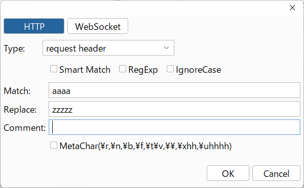
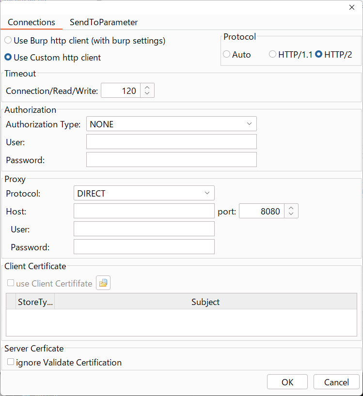
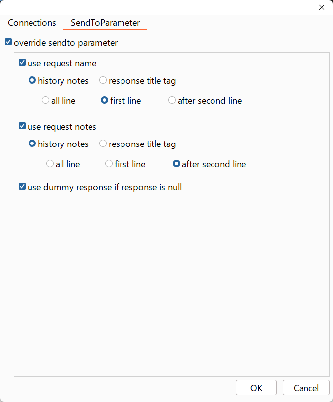
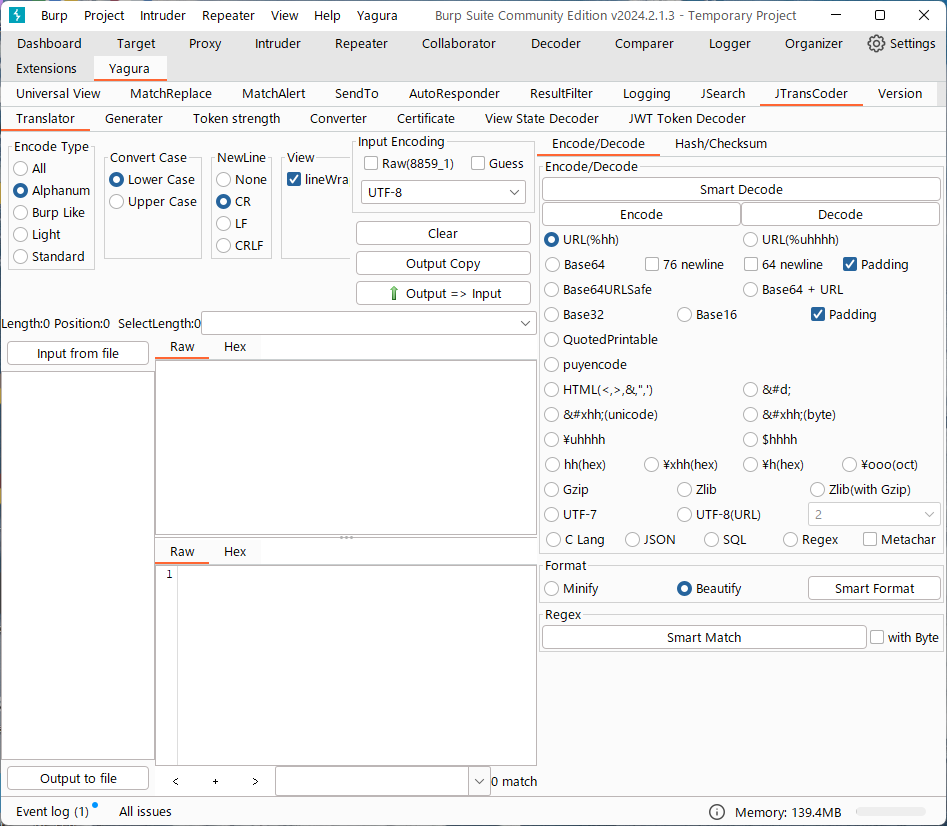
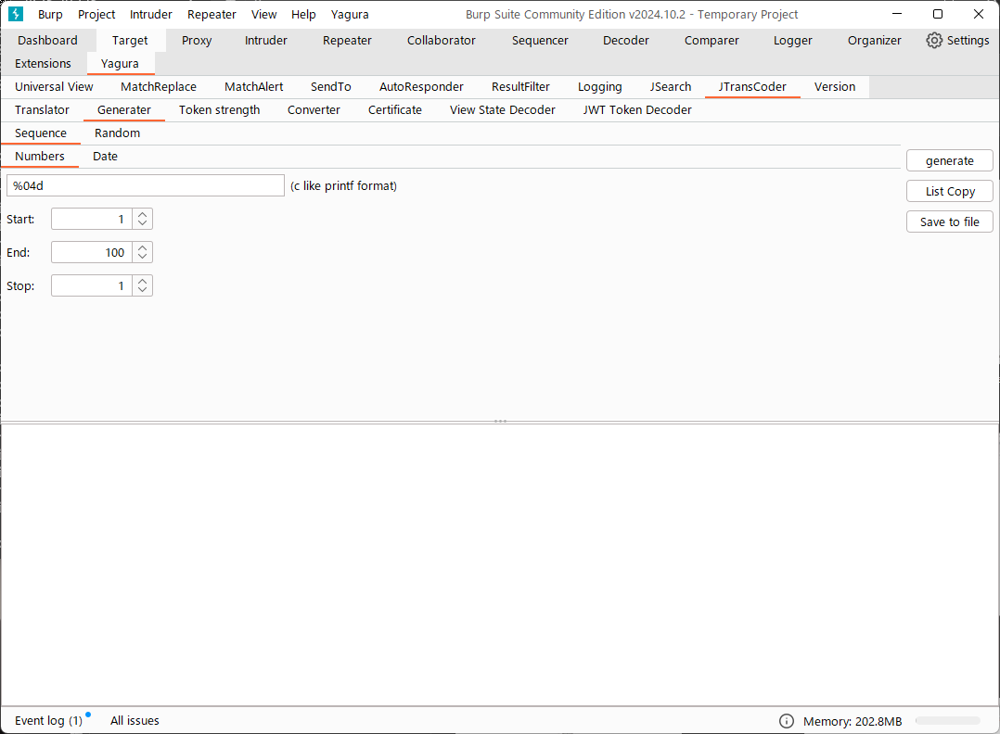
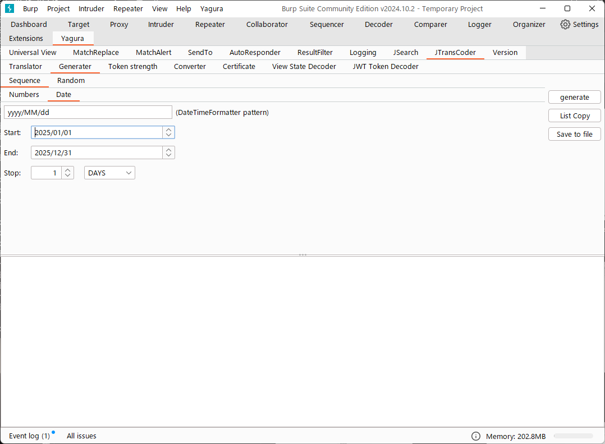
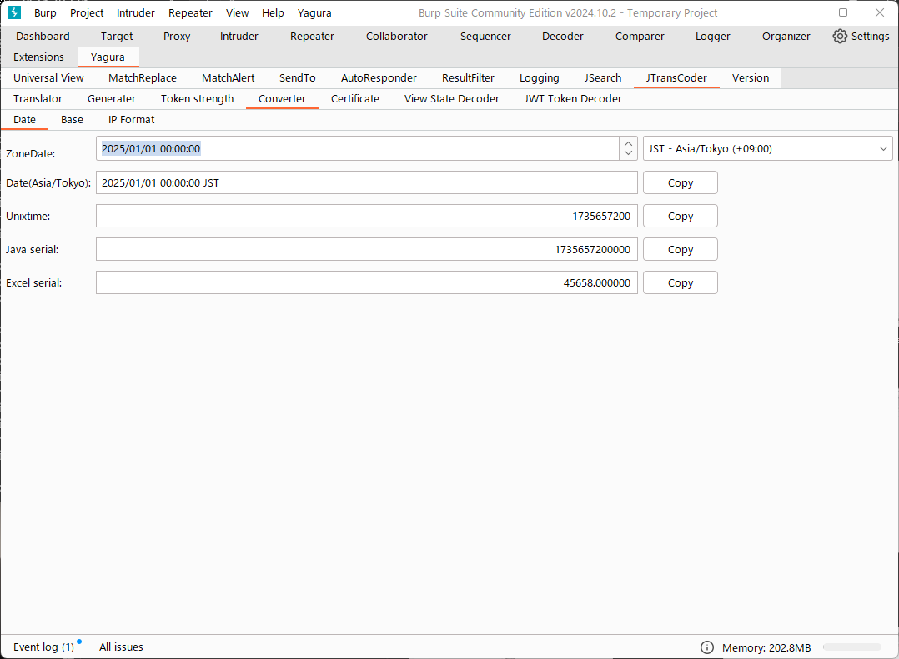
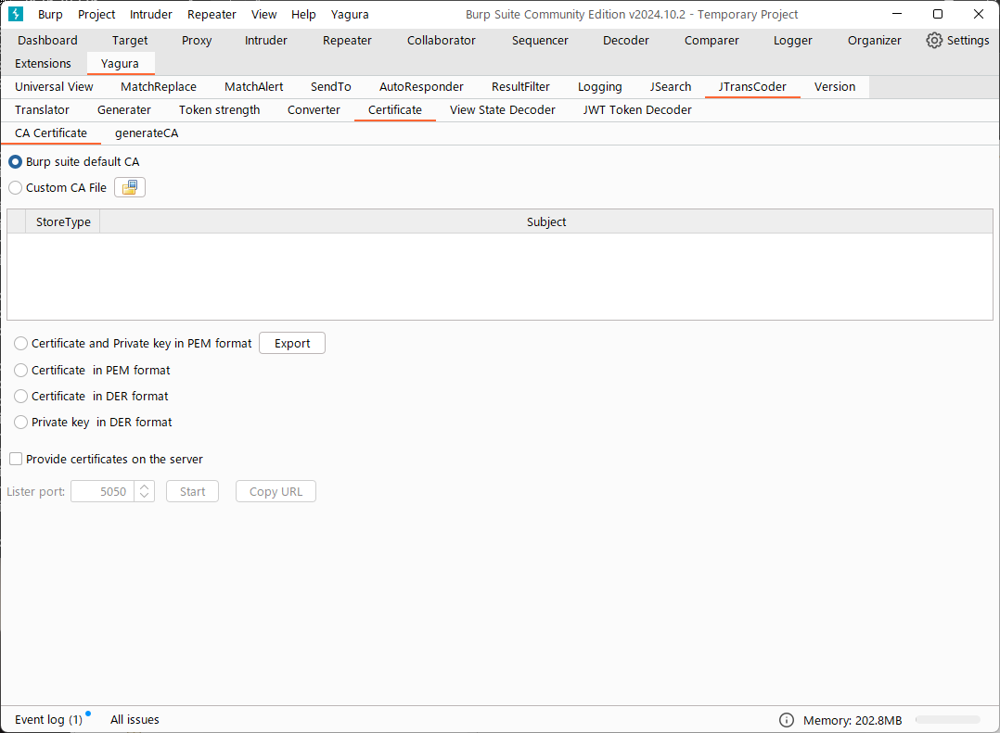
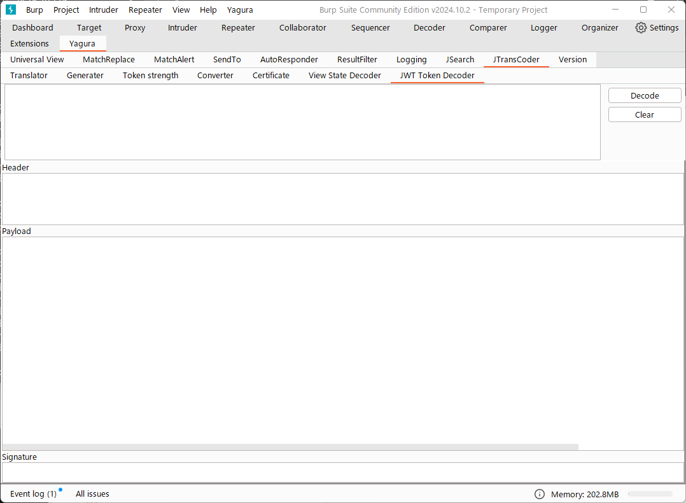
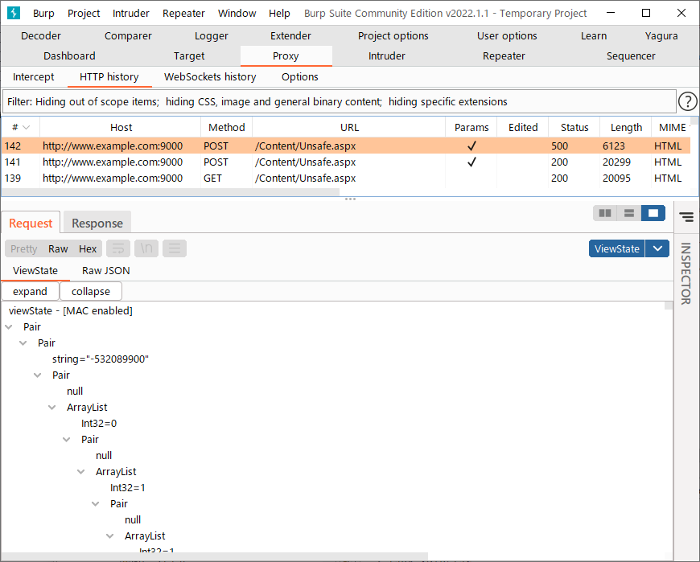

= YaguraExtension ヘルプ
:toc2:
:toclevels: 3
:figure-caption: 図
:table-caption: 表
:numbered:

Language/xref:help.adoc[English]

== Start up 
Burp suiteの「Extensions」タブから「Add」ボタンを押下後、YaguraExtension.jar を追加します。
「Loaded」にチェックをいれることで拡張がロードされ、Burp sute本体のタブに「Yagura」タブが追加されます。
各種設定はこちらから行えるようになっています。

image:images/Extender_Yagura.png[Extension]

== Yagura Menu

IntercepterやRepeterにてYaguraのEncode/Decodeの各種変換機能を呼び出すことができます。

=== Yagura Charsets

各種変換機能で利用するデフォルトの文字コードを選択できます。指定した文字コードでEncode/Decodeできます。
 
   ISO-8859-1/UTF-8/US-ASCII/... ::
     文字コードを指定します。
     選択可能な文字コードは、[CJK View]で指定することができます。

   Use Burp Charsets::
      BurpのCharsetの設定を利用します。
      ただし、「recognize_automatically」が選択されている場合の文字コードはBurpが解釈している文字コードと一致しない可能性があります。

=== Encoder

選択された文字列を「Yagura Charsets」にて選択した文字コードにてEncodeします。
次の変換に対応しています。
  
  * URL
  * Unicode(URL)
  * Unicode(JSON)
  * Base64
  * Base64URLSafe
  * Html
  * JSON with Meta
  
=== Decoder

選択された文字列を「Yagura Charsets」にて選択した文字コードにてDecodeします。
次の変換に対応しています。

  * URL
  * Unicode(URL)
  * Unicode(JSON)
  * Base64
  * Base64URLSafe
  * Html
  * JSON with Meta

=== Converter

選択された文字列を「Yagura Charsets」にて選択した文字コードにて変換します。
次の変換に対応しています。

  * Upper Case
  * Lower Case
  * bin2hex
  * hex2bin
  * Full width -> Half width
  * Half width -> Full width

=== Hash

選択された文字列を「Yagura Charsets」にて選択した文字コードにてHash計算します。
次の変換に対応しています。

  * md2
  * md5
  * sha1
  * sha256
  * sha384
  * sha512

=== Result Filter

Proxy HistoryのBambda mode のクエリを切り替えることが可能です。
Result FilterタブでBambda modeを切り換えるためのタブを作成することができます。

=== Extension

選択した拡張機能を実行します。

  Paste include Target scope(multi-line)::
    クリップボードに設定された、複数行のURLをTarget Scopeの Include in scope に追加します。

  Paste include Top URL Target scope(multi-line)::
    クリップボードに設定された、複数行のTop URLをTarget Scopeの Include in scope に追加します。

  Paste exclude Target scope(multi-line)::
    クリップボードに設定された、複数行のURLをTarget Scopeの Exclude from scope に追加します。

  Paste SSL pass through(multi-line)::
    クリップボードに設定された、複数行のURLをTarget Scopeの SSL pass through に追加します。

=== Burp Charsets

BurpのUser設定の文字コードを変更します。
Burpの [User Interface] -> [Inspector and Message Editor] の Charsetsの切り替えと同等です。

== Yaguraタブ

=== CJK Viewタブ

image:images/custom_encoding.png[CJK Viewタブ]

いわゆるCJK(中国語、日本語、韓国語)に対応するための設定を行うタブです。
使用頻度の高い Encoding を選択することができます。ここで選択した値は、JTransCoderまたはJSONビューの表示画面で選択できるエンコードです。

==== CJK View

Target::
    Javaで利用可能なすべてのエンコーディングリスト一覧が表示されます。

Select::
    選択したエンコーディング一覧されます。

[<]、[>] ボタン::
    選択したエンコーディングをTargetに移動もしくは、Selectに移動します。

[Up]、[Down] ボタン::
    選択したエンコーディングの順番を移動します。
    ここでの順番が、エンコーディングに表示される順番になります。

[Reset] ボタン::
    選択された言語のエンコーディングをデフォルトに設定します。

[clip bord auto decode] チェックボックス::
    チェック時、Burp suiteからクリップボードにコピーされた文字列を自動デコードし、他のアプリケーションに文字化けせずに貼り付けられるようにします。
    クリップボード内のバイト文字列から文字コードを推測しているため、判定に失敗する場合があります。 +
    現在のバージョンではサポートされていません。

==== CJK Message View

[Cenerate PoC] チェックボックス::
    メッセージタブにCenerate PoCタブを表示するようにします。
   
[HTML Comment] チェックボックス::
    メッセージタブにHTML Commentタブを表示するようにします。

[JSON] チェックボックス::
    メッセージタブにJSONタブを表示するようにします。

[JSONP] チェックボックス::
    メッセージタブにJSONPタブを表示するようにします。

[JWT] チェックボックス::
    メッセージタブにJWTタブを表示するようにします。

[ViewState] チェックボックス::
    メッセージタブにViewStateタブを表示するようにします。

[Universal Raw] チェックボックス::
    メッセージタブにCJKに対応したRawタブを表示するようにします。
    現時点ではリードオンリーです。

[Universal Param] チェックボックス::
    メッセージタブにCJKに対応したParamタブを表示するようにします。
    現時点ではリードオンリーです。

[lineWrap]::
    Viewで文字を折り返すかを設定します。チェック時は折り返されます｡

[Display max length]::
    Viewを表示する最大のサイズを設定します。リクエストまたはレスポンスのサイズが非常に大きい場合、応答しなくなる可能性があります。

=== MatchReplaceタブ

image:images/custom_matchreplace.png[MatchReplaceタブ]

Burp sute 本体の Proxy => Optionタブの ** Match and Replace ** の拡張になります。複数の ** Match and Replace ** を作成して切り替えられます。
置換文字列として正規表現の前方参照を指定できます。Burp本体の ** Match and Replace ** とは独自実装となっていて、本体側のMatch and Replaceが評価されたあと拡張側のMatch and Replaceが評価されます。

==== MatchReplace

[Select] ボタン::
    選択したMatchReplaceを適用します。
    適用済みを再度選択した場合は、解除されます。

[New] ボタン::
    MatchReplaceを新規作成します。
    空のMatchReplaceItemダイヤログが表示されます。

[Edit] ボタン::
    選択したMatchReplaceを編集します。
    選択した内容のMatchReplaceItemダイヤログが表示されます。

[Remove] ボタン::
    選択したMatchReplaceを削除します。

[Up]、[Down] ボタン::
    選択したMatchReplaceの順番を移動します。

==== MatchReplace ダイヤログ
image:images/custom_matchreplace_edit.png[MatchReplaceItemダイヤログ]

[in-scope only] チェックボックス::
    BurpのTarget Scopeの条件にマッチする場合のみ検索します。

[burp import match and replace rule] ボタン::
    現在のBurpのmatch and replace設定をインポートします。 +
    現在のバージョンではサポートされていません。

[Edit] ボタン::
    選択した MatchReplace を編集します。

[Remove] ボタン::
    選択した MatchReplace を削除します。

[Up]、[Down] ボタン::
    選択した MatchReplace Item の順番を移動します。

[All Clear] ボタン::
    リストをすべて削除します。

[Add]、[Update] ボタン::
    MatchReplace を追加します。編集中の場合は更新します。

==== MatchReplace Item 編集ダイヤログ

Type(置換対象)::
    request heder,request body,response heder,response bodyのいずれかから選択します。

Match(置換前)::
    置換対象の置換前の文字列を入力します。

Replace(置換後)::
    置換対象の置換後の文字列を入力します。
    置換対象に request heder,response hederが選択されている場合でかつ置換後の文字のみを入力した場合はHeder行の追加になります。
    また、$1、$2などのキャプチャグループを指定することができます。
    いわゆるアスキー文字以外をここには指定することはできません。指定した場合、文字は、?に変換されてしまいます。
    アスキー文字以外を指定する場合は、メタ文字を利用します。

[Regexp] チェックボックス::
    チェック時、正規表現を有効にします。

[IgnoreCase] チェックボックス::
    チェック時、大文字小文字を無視します。

[Metachar] チェックボックス::
    メタ文字を有効にします。
    以下のメタ文字が利用可能です。

[options="header", cols="2,8"]
|=======================
|メタ文字|変換文字
|\r      |CR(0x0d) に変換
|\n      |LF(0x0a) に変換
|\b      |0x08 に変換
|\f      |0x0c に変換
|\t      |TAB(0x09) に変換
|\v      |0x0b に変換
|\xhh    |16進表記、 hhには16進文字を2桁指定する。バイト列そのままに変換したい場合に利用します。
|\uhhhh  |Unicode表記、 hhhhにはUnicodeコードを16進指定する。Unicode文字は推測したレスポンスの推測した文字コードに自動で変換されます。対応する文字が存在しない場合、?に変換されます。
|=======================

=== MatchAlertタブ

image:images/custom_matchalert.png[MatchAlertタブ]

指定した文字列にマッチする文字がレスポンスに現れた場合に通知してくれます。 ExceptionなどのErrorCode系の文字列を登録することを想定しています。
通知方法には以下の５つの方法があり、同時に複数の方法を選択できます

. BurpのAlertsタブにて通知する方法
. タスクトレイのメッセージにて通知する方法 +
    現在のバージョンではサポートされていません。
. マッチしたヒストリのHighlightColorを変更する方法 +
    proxyにチェックが入っている場合に有効です。
. マッチしたヒストリのCommentを変更する方法 +
    proxyにチェックが入っている場合に有効です。
. マッチした内容と指定した値にてScannerのIssueを作成します。

==== MatchAlert

[Enable Alert] チェックボックス::
    チェック時にMatchAlert機能を有効にします。
[Edit] ボタン::
    選択した MatchAlert Item を編集します。
[Remove] ボタン::
    選択した MatchAlert Item を削除します。
[Add]、[Update] ボタン::
    MatchAlert Item を追加します。編集中時は更新します。

==== MatchAlert Item 編集ダイヤログ

image:images/custom_matchalert_item.png[MatchAlertItem編集ダイヤログ]

Type(検索対象)::
    request,responseのいずれかから選択

Match(マッチ文字列)::
    マッチさせたい文字列を入力します。

Target(アラート対象)::
    proxy, repeater, spider, intruder, scanner, sequencer, extender
    チェックした対象がMatchAlertの対象になります。

[Regexp] チェックボックス::
    チェック時正規表現を有効にします。

[IgnoreCase] チェックボックス::
    チェック時大文字小文字を無視します。

[alert tabs] チェックボックス::
    Burp suite のalertsが通知先になります。

[tray message] チェックボックス::
    トレイのメッセージが通知先になります。
    現在のバージョンではサポートされていません。

[Highlight Color] チェックボックス::
    文字列がマッチした場合、該当のBurpのHistoryのHighlightColorが指定した色になります +
    proxyログにチェックした場合のみ有効です。

[comment] チェックボックス::
    文字列がマッチした場合、該当のBurpのHistoryのCommentが指定したコメントになります +
    proxyログにチェックした場合のみ有効です。

[capture group] チェックボックス::
    文字列がマッチした場合、マッチしたキャプチャグループの文字列をコメントに設定することができます +
    コメントの箇所に「$1」、「$2」等のグループ参照を指定することで該当のグループの値がコメントになります。

[scanner issue] チェックボックス::
    文字列がマッチした場合、該当のScannerのIssueを作成します。

=== SendToタブ

image:images/custom_sendto.png[SendToタブ]

Burpがもつ拡張メニューを利用した機能です。
BurpのHistory等から表示される右クリックのメニューを増やすことができ、 メニューから指定した機能を呼び出すことができます。送られる内容は、選択したHistoryのリクエストとレスポンスの内容になります。 

==== SendTo

[Send To Submenu] チェックボックス::
    チェックした場合、Send To Menuをサブメニューで表示します。

[Edit] ボタン::
    選択したSendToItemを編集します。
    選択した内容のSendToItemの編集ダイヤログが表示されます。

[Remove] ボタン::
    選択したSendToItemを削除します。

[Up]、[Down] ボタン::
    選択したSendToItemの順番を移動します。
    ここでの順番が、右クリックのメニューに表示される順番になります。

[Add] ボタン::
    SendToItemを追加します。
    空のSendToItemの編集ダイヤログが表示されます。

[Duplicate] ボタン::
    SendToItemを複製します。
    選択したSendToItemの編集ダイヤログが表示されます。
    各項目を任意に変更して追加することができます。

==== SendToItem 編集ダイヤログ

SendToには、Baseタブと、Extendタブがあります。 Baseタブでは、バイナリエディタやファイル比較ツール等を登録すると便利です。 右クリックからエディタを呼び出すと、一時的に作られたファイルを引数にしてバイナリエディタが起動されます。 比較ツールの場合、2つHistoryを選択することで比較することができます。 これは BurpのHEX ダンプやCompare機能が使いにくいためにつくりました。

ExtendタブにはBaseタブでは対応ができない便利な機能をあつめてます。

==== Baseタブ
image:images/custom_sendto_base.png[SendToItem編集 Base ダイヤログ]

Menu Caption::
    メニュー名

Target::
    任意のバイナリエディタやファイル比較ツール等の実行パスを記載します。
    serverにチェックが入ってる場合は、http:// または https:// で始まるURLを書きます。

[server] チェックボックス::
    サーバに送信する場合にチェックします。
    serverにチェックが入ってる場合は、Target に記載されたURLに対してmultipartのデータを送ります。

[reverse order] チェックボックス::
    選択したリストの逆順に送信をおこないます。

[requset]、[response] チェックボックス::
    リクエストの requsetまたは、responseをチェックした場合に登録したTargetに送ります。 +
    リクエストおよびレスポンスはヘッダおよびボディのいずれかの送信を選択できます。

===== HTTP Connection 設定ダイヤログ

サーバに送信する場合にチェックされている場合、SendToの送信に利用されるHTTPクライアントの設定が可能となります。

サーバにチェックされている場合に設定可能となります。

* Use Burp Proxy Settings
** SendToの送信にBurpのHTTPクライアントを利用します。

* Use Custom Proxy Settings
** SendToの送信に独自のHTTPクライアントを利用します。

.Timeout

Connection/Read/Write::
    タイムアウトまでの秒数を指定します。

.Authorization

Authorization Type::
    認証の方式を指定します。BASICとDIGESTを選択可能です｡

User::
    認証ユーザ名を指定します。
  
Password::
    認証パスワードを指定します。

.Proxy

Protocol::
    Proxyのプロトコルを指定します。HTTPとSOCKSを選択可能です｡

Host::
    Proxyのホストを入力します。

Port::
    Proxyのポート番号を入力します。

User::
    Proxyの認証ユーザ名を指定します。
  
Password::
    Proxyの認証パスワードを指定します。

.Client Certificate
 use Client Certificateチェックボックス:: クライアント証明書を有効にします。

.Server Certificate
 ignore Validate Certificationチェックボックス:: チェックされている場合HTTPSサーバ証明書の検証を無視します。

===== SendTo Parameter 設定ダイヤログ

サーバにチェックされている場合に設定可能となります。

SendToの送信に利用されるリクエストパラメータのカスタマイズをします。

override SendTo parameter::
  SendToの送信にBurpのHTTPクライアントを利用します。

use request name::
 reqNameパラメータに指定した内容で送信します。

. history comment +
 proxyのヒストリのコメントを送信します。

. response title tag +
 レスポンスのタイトルタグの値を送信します。

use request comment::
    reqCommentパラメータに指定した内容で送信します。
    送信可能な内容はreqNameと同じです。

===== サーバチェック時にサーバに送信される形式

multipart のデータ形式でサーバに送信されます。次の内容を含みます。

    host ::
        ホスト名
    port::
        ポート名
    protocol::
        protocol名(httpまたは、https)
    url::
        url文字列
    requset::
        リクエスト
    response::
        レスポンス
    comment::
        コメント
    reqName::
        リクエスト名
    reqComment::
        リクエストコメント
    highlight::
        選択した Highlight Color
        以下のいずれかの値になります。 +
        white, red, orange, yellow, green, cyan, blue, pink, magenta, gray +
        white は選択されていない状態と等価です。
    encoding::
        推測エンコーディング

----
Content-Type: multipart/form-data; boundary=---------------------------265001916915724
Content-Length: 988

-----------------------------265001916915724
Content-Disposition: form-data; name="host"

example.jp
-----------------------------265001916915724
Content-Disposition: form-data; name="port"

80
-----------------------------265001916915724
Content-Disposition: form-data; name="protocol"

http
-----------------------------265001916915724
Content-Disposition: form-data; name="url"

http://example.jp/
-----------------------------265001916915724
Content-Disposition: form-data; name="comment"

-----------------------------265001916915724
Content-Disposition: form-data; name="reqName"

-----------------------------265001916915724
Content-Disposition: form-data; name="reqComment"

-----------------------------265001916915724
Content-Disposition: form-data; name="highlight"

red
-----------------------------265001916915724
Content-Disposition: form-data; name="request"; filename="request"
Content-Type: application/octet-stream

request header and body
-----------------------------265001916915724
Content-Disposition: form-data; name="response"; filename="response"
Content-Type: application/octet-stream

Response header and body
-----------------------------265001916915724
Content-Disposition: form-data; name="encoding"

UTF-8
-----------------------------265001916915724--
----

現時点ではこの形式を解釈することができる（公開されている）Webアプリはありません。
sample/sendto.php にはこの形式を受け取って表示するだけのPHPアプリケーションのサンプルをおいています。実装したい場合はこちらを参考にしてください。

==== Extendタブ
image:images/custom_sendto_extend.png[SendToItem編集 Extend ダイヤログ]

     send to jtranscoder::
          JTransCoder のInputに選択した文字列を送ります。
     request and response to file::
          リクエストとレスポンスをファイルに保存します。
     request body to file::
          リクエストのボディの部分のみをファイルに保存します。
     response body to file::
          レスポンスのボディの部分のみをファイルに保存します。
     paste from jtranscoder::
          JTransCoder のOutputから文字列を貼り付けます。
     paste from clipboard::
          クリップボードから指定したエンコーディングにて文字列を貼り付けます。
     message info copy::
          message の情報をクリップボードにコピーします。
     add host to include scope::
          URLのスキームとホストをinclude in scopeに追加します。
     add host to exclude scope::
          URLのスキームとホストをexclude in scopeに追加します。
     add exclude scope::
          URLをexclude in scopeに追加します。

=== AutoResponderタブ

image:images/custom_autoresponder.png[AutoResponderタブ]

リクエストに対応した固定のレスポンスを定義することができます。

[Enable] ボタン::
    チェック時に、AutoResponderを有効にします。

[Edit] ボタン::
    選択したAutoResponderItemを編集します。
    選択した内容のAutoResponderItemの編集ダイヤログが表示されます。

[Remove] ボタン::
    選択したAutoResponderItemを削除します。

[Up]、[Down] ボタン::
    選択したAutoResponderItemの順番を移動します。
    ここでの順番が、AutoResponderの適用される順番になります。

[Add] ボタン::
    AutoResponderItemを追加します。
    空のAutoResponderItemの編集ダイヤログが表示されます。

==== AutoResponderItem 編集ダイヤログ

image:images/custom_autoresponder_item.png[AutoResponderItem編集 ダイヤログ]

Method::
    マッチさせるメソッドを指定します。Anyにチェックした場合は任意のメソッドにマッチします。

Match URL::
    マッチさせるURLを指定します。指定された値は前方一致されます。

[Regexp] チェックボックス::
    チェック時、マッチさせるURLに対しての正規表現を有効にします。

[IgnoreCase] チェックボックス::
    チェック時マッチさせるURLに対しての大文字小文字を無視します。

Replace::
    レスポンスとして利用するファイルを指定します。

[Body only] チェックボックス::
    レスポンスとして指定したファイルをレスポンスボディに出力します。
    チェックされていない場合は、ファイルにレスポンスヘッダの記載も必要です。

[Conent-Type] コンボボックス::
    レスポンスのConent-Typeを指定します。[Body only]にチェックがされている場合にのみ有効です。

=== ResultFilterタブ

image:images/custom_resultfilter.png[ResultFilterタブ]

ProxyのBambda modeを切り替えるための設定を行います｡

[New] ボタン::
    ResultFilterItemを追加します。
    空のResultFilterItemの編集ダイヤログが表示されます。

[Edit] ボタン::
    選択したResultFilterItemを編集します。
    選択した内容のResultFilterItemの編集ダイヤログが表示されます。

[Remove] ボタン::
    選択したResultFilterItemを削除します。

[Up]、[Down] ボタン::
    選択したResultFilterItemの順番を移動します。

==== ResultFilterItem 編集ダイヤログ

image:images/custom_resultfilter_item.png[ResultFilterItem編集 ダイヤログ]

[Convert to Bambda] ボタン::
  指定された設定をBambda クエリーに変換します。

[Import Bambda] ボタン::
  BurpのBambda設定をインポートします。

=== Loggingタブ

image:images/custom_logging.png[Loggingタブ]

ログの自動ロギング機能です。
この機能では、毎回ログの選択を行わなくても自動でログを 保存してくれます。 

==== Logging

[auto logging] チェックボックス::
    チェックすると自動でログを記録します。LogDirで指定したディレクトリに作成されます。

Log Dir::
    ログを作成するディレクトリを指定します。
    日付形式(burp_yyyyMMdd)のディレクトリが作成されます。
    同じ日付が既に存在する場合は、その日付のディレクトリが使われます。出力するログファイル名が存在した場合は追記されます。

Log size::
    ログファイルの上限サイズを指定します。ファイル上限に達した場合は新しい名前でログが作成されます。
    ログサイズの上限に達した場合は、.1,.2のように付加されていきます。
----
proxy-message.log
proxy-message.log.1
proxy-message.log.2
	:
----

0を指定した場合は上限はありません。

Compress Log::
    ログを圧縮します｡

===== Logging target

[ProxyLog] チェックボックス::
     Match and Replace や Inspecter での変更後の値のProxyLogが記録されます。

[ToolLog] チェックボックス::
     各種Toolのログの値が記録されます。

[history is included] チェックボックス::
     auto loggingがオフの状態でのみチェックできます。
     チェックすると現時点でHistoryに記録されているすべてののログをファイルに記録します。

[Exclude Extension] チェックボックス::
     設定された拡張子をロギングから除外します。

===== Temporary project

[Temporary project warning when closing  Burp Suite] チェックボックス::
    Temporary projectの状態でBurpを閉じようとするとポップアップによる警告を表示します。

[Popup Time] ::
     Popupしている時間を 1000 ms から 10000 ms までの間で指定します。デフォルトは 3000 msです。

=== JSearchタブ

image:images/custom_jsearch.png[JSearchタブ]

JSearch タブはProxyのHistory一覧から文字を検索するための機能です。

==== JSearch

[Search] ボタン::
     ProxyのHistory一覧からテキストボックスに入力した値で検索します。

[Smart Match] チェックボックス::
    HTMLエスケープ、URLエンコードなど複数のエスケープ考慮した検索を実行します。
    正規表現は有効にできません。

[Regexp] チェックボックス::
    チェック時正規表現を有効にします。

[IgnoreCase] チェックボックス::
    チェック時大文字小文字を無視します。

[in-scope only] チェックボックス::
    検索対象をBurpのTargetタブのscopeに一致するパスにします。

request::
    検索対象をリクエスト(Header,Body)を指定します。

response::
    検索対象をレスポンス(Header,Body)を指定します。

[comment] チェックボックス::
    検索対象にコメントを含めます。

Search Encoding::
    検索時のエンコーディングを指定します。

=== JTransCoderタブ
Transcoder タブは各種エンコード、デコードを行うための機能です。

==== Translator

Encode Type::
     Encode時の変換する対象の文字列を指定します。

Convert Case::
     文字がエンコードされたときの16進表記を大文字にするか小文字するかを指定します。

NewLineMode::
     エディタの改行コードを指定します。

View::
     lineWrap にチェックすると表示が折り返されます。

Encodeing::
     変換する文字のエンコーディングを指定します。コンボボックスで選択可能なエンコーディングは、Encodingタブで設定したものが表示されます。 +
     Raw にチェックすると ISO-8859_1 にてエンコード、デコードします。 +
     Guess にチェックすると文字コードを自動で判定してエンコード、デコードします。

[Clear] ボタン::
     InputおよびOutputの内容をクリアします。

[Output => Input] ボタン::
     Outputの内容をInputに送ります。

[Output Copy] ボタン::
     Outputの内容をクリップボードに送ります。

[History] コンボボックス::
     変換した履歴が記録されており、選択すると以前の変換を取得できます。

===== Encode/Decode

[Smart Decode] ボタン::
     文字列の形式を自動判定しデコードします。

[Encode]/[Decode] ボタン::
     選択した変換方式でエンコード、デコード変換を行います。

チェックしたエンコード/デコードを行います。

URL(%hh)::
     URLエンコード、デコードを行います。

URL(%uhhhh)::
     Unicode形式のURLエンコード、デコードを行います。

Base64::
    Base64形式のエンコード、デコードを行います。

64 newline::
    Base64形式のエンコード時に64文字で改行を行う場合に指定します。

76 newline::
    Base64形式のエンコード時に76文字で改行を行う場合に指定します。

Padding::
    Base64形式のエンコード時にパディングするかを指定します。

Base64URLSafe::
    Base64 URLSafe形式のエンコード、デコードを行います。

Base32::
    Base32形式のエンコード、デコードを行います。

Base16::
    Base16形式のエンコード、デコードを行います。

QuotedPrintable::
    QuotedPrintable形式のエンコード、デコードを行います。

Punycode::
    Punycodeエンコード、デコードを行います。

HTML(<,>,",')::
    HTMLのエンコード、デコードを行います。
    エンコードは、「<,>,",'」のみ行われます。

&#d;::
    10進数形式の実体参照形式のエンコード、デコードを行います。

&#xhh;::
    16進数形式の実体参照形式のエンコード、デコードを行います。

hh(unicode)::
    byteコード単位で16進数形式によるエンコード、デコードを行います。

\xhh(byte)::
    byteコード単位で16進数形式によるエンコード、デコードを行います。

\xhh(byte)::
    byteコード単位で16進数形式によるエンコード、デコードを行います。

\ooo::
    8進数形式によるエンコード、デコードを行います。

\uhhhh::
    Unicode形式によるエンコード、デコードを行います。

$hhhh::
    $形式によるエンコード、デコードを行います。

Gzip::
    Gzipによる圧縮、解凍を行います。

ZLIB::
    ZLIBによる圧縮、解凍を行います。

ZLIB(with Gzip)::
    ZLIB(GZIP 互換の圧縮をサポート)による圧縮、解凍を行います。

UTF-7::
    UTF-7のエンコード、デコードを行います。

UTF-8::
    UTF-8のエンコードを行います。2バイト表現、3バイト表現、4バイト表現をURLエンコードします。

C Lang::
    C言語形式のエスケープを行います。

JSON::
   JSON形式のエスケープを行います。

SQL::
    SQL言語形式のエスケープを行います。

Regex::
    正規表現のエスケープを行います。

Metachar チェックボックス::
    メタ文字をエンコード、デコード可能にします。
    以下のメタ文字が利用可能です。

[options="header", cols="2,8"]
|=======================
|メタ文字|変換文字
|\r      |CR(0x0d) に変換
|\n      |LF(0x0a) に変換
|\t      |TAB(0x09) に変換
|=======================

===== Format

Minify::
    XMLやJSONを圧縮します。

Beautify::
    XMLやJSONを整形します。

[Smart Format]ボタン::
     文字列を整形します。XMLおよびJSONの整形に対応しています。

===== Regex

Smart Math::
   Smart Mathは、各種エスケープを考慮したマッチを行うための正規表現を生成します。

with Byte::
   チェック時、Smart Mathにバイトマッチを考慮した正規表現を含めます。

===== Hash/Checksum

テキストエリアに入力されている値でハッシュ値計算を行います。

md2::
    md2によるハッシュを計算します。

md5::
    md5によるハッシュを計算します。

sha1::
    sha1によるハッシュを計算します。

sha256::
    sha256によるハッシュを計算します。

sha384::
    sha384によるハッシュを計算します。

sha512::
    sha512によるハッシュを計算します。

sha512/224::
    sha512/224によるハッシュを計算します。

sha512/256::
    sha512/256によるハッシュを計算します。

sha3-224::
    sha3-224によるハッシュを計算します。

sha3-256::
    sha3-256によるハッシュを計算します。

sha3-384::
    sha3-384によるハッシュを計算します。

sha3-512::
    sha3-512によるハッシュを計算します。

SHAKE128::
    SHAKE128によるハッシュを計算します。

SHAK256::
    SHAK256によるハッシュを計算します。

SKEIN-256-128::
    SKEIN-256-128によるハッシュを計算します。

SKEIN-256-160::
    SKEIN-256-160によるハッシュを計算します。

SKEIN-256-224::
    SKEIN-256-224によるハッシュを計算します。

SKEIN-256-256::
    SKEIN-256-256によるハッシュを計算します。

SKEIN-512-128::
    SKEIN-512-128によるハッシュを計算します。

SKEIN-512-160::
    SKEIN-512-160によるハッシュを計算します。

SKEIN-512-224::
    SKEIN-512-224によるハッシュを計算します。

SKEIN-512-256::
    SKEIN-512-256によるハッシュを計算します。

SKEIN-512-384::
    SKEIN-512-384によるハッシュを計算します。

SKEIN-512-512::
    SKEIN-512-512によるハッシュを計算します。

SKEIN-1024-384::
    SKEIN-1024-384によるハッシュを計算します。

SKEIN-1024-512::
    SKEIN-1024-512によるハッシュを計算します。

SKEIN-1024-1024::
    SKEIN-1024-1024によるハッシュを計算します。

KECCAK-288::
    KECCAK-288によるハッシュを計算します。

KECCAK-384::
    KECCAK-384によるハッシュを計算します。

KECCAK-512::
    KECCAK-512によるハッシュを計算します。

HARAKA-256::
    HARAKA-256によるハッシュを計算します。

HARAKA-512::
    HARAKA-512によるハッシュを計算します。

RIPEMD128::
    RIPEMD128によるハッシュを計算します。

RIPEMD160::
    RIPEMD160によるハッシュを計算します。

RIPEMD256::
    RIPEMD256によるハッシュを計算します。

RIPEMD320::
    RIPEMD320によるハッシュを計算します。

GOST3411::
    GOST3411によるハッシュを計算します。

GOST2012-256::
    GOST3411-2012-256によるハッシュを計算します。

GOST2012-512::
    GOST3411-2012-512によるハッシュを計算します。

DSTU7564-256::
    DSTU7564-256によるハッシュを計算します。

DSTU7564-384::
    DSTU7564-384によるハッシュを計算します。

DSTU7564-512::
    DSTU7564-512によるハッシュを計算します。

BLAKE2B-160::
    BLAKE2B-160によるハッシュを計算します。

BLAKE2B-256::
    BLAKE2B-256によるハッシュを計算します。

BLAKE2B-384::
    BLAKE2B-384によるハッシュを計算します。

BLAKE2B-512::
    BLAKE2B-512によるハッシュを計算します。

BLAKE2S-128::
    BLAKE2S-128によるハッシュを計算します。

BLAKE2S-160::
    BLAKE2S-160によるハッシュを計算します。

BLAKE2S-224::
    BLAKE2S-224によるハッシュを計算します。

BLAKE2S-256::
    BLAKE2S-256によるハッシュを計算します。

BLAKE3-256::
    BLAKE3-256によるハッシュを計算します。

Tiger::
    Tigerによるハッシュを計算します。

WHIRLPOOL::
    WHIRLPOOLによるハッシュを計算します。

SM3::
   SM3Lによるハッシュを計算します。

CRC32::
    crc32によるチェックサムを計算します。

CRC32C::
    crc32cによるチェックサムを計算します。

Adler-32::
    Adlerによるチェックサムを計算します。

MurmurHash2/32::
    MurmurHash2 32bitによるチェックサムを計算します。

MurmurHash2/64::
    MurmurHash2 64bitによるチェックサムを計算します。

==== Generaterタブ

Generater には、sequenceタブとrandomタブがあります。

.sequenceタブ

sequenceタブは連続する文字リストを生成するための簡易的な機能です。

.sequence-Numbersタブ

生成書式文字列入力::
    C言語のprintf形式の書式文字列を入力します。
    書式文字列は数字関係の書式を一つしか指定できません。

start::
    リストの開始の数字を入力します。

end::
    リストの終了の数字を入力します。終了の数字まで生成されます。

step::
    startからendまでの数字の増加数を指定します。

.sequence-Dateタブ

生成書式文字列入力::
    Java言語のDateTimeFormatter形式の書式文字列を入力します。

start::
    リストの開始の日付を入力します。

end::
    リストの終了の日付を入力します。終了の日付まで生成されます。

step::
    startからendまでの日付の増加数を指定します。

[generate] ボタン::
  指定した情報でリストを生成します。

[List Copy] ボタン::
  生成したリストをクリップボードに出力します。

[Save to file] ボタン::
  生成したリストをファイルに出力します。

.randomタブ

randomタブはランダムな文字リストを生成するための簡易的な機能です。

image:images/custom_gene_random.png[randomタブ]

Character::
    Characterは生成する文字の種類を指定します。

Character length::
    生成する文字数の長さを指定します。

generator count::
    生成する個数を入力します。

[generate] ボタン::
    指定した情報でリストを生成します。

[List Copy] ボタン::
    生成したリストをクリップボードに出力します。

[Save to file] ボタン::
    生成したリストをファイルに出力します。

==== Converter tab

Baseタブは基数変換するための簡易的な機能です。

.Baseタブ

image:images/custom_converter_base.png[Baseタブ]

Bin::
    2進数を入力します。

Oct::
    8進数を入力します。

Dec::
    10進数を入力します。

Hex::
    16進数を入力します。

Radix32 ::
    32進数を入力します。

.Dateタブ

ZoneDate::
    日付を入力します。

Date(デフォルトゾーンID)::
    入力された日付をデフォルトのゾーンIDで変換して表示します。

Unixtime::
    Unixtimeの値を入力します。

Java serial::
    Javaのミリ秒で表される時間を入力します。

Excel serial::
    Excelのシリアル値で表される時間を入力します。

.IP Formatタブ

IPアドレスを各形式に変換します。

Dotted Decimal IP ::
    変換元になるIPv4のアドレスを入力します。

    例:192.168.2.1

Dotted Octal IP ::
    「.」で区切られた8進数のIPアドレスに変換します。

     例:0300.0000.0002.0001

Octal IP ::
    8進数のIPアドレスに変換します。

    例:030000001001

Dotted Hex IP ::
   「.」で区切られた16進数のIPアドレスに変換します。

    例:0xc0.0x00.0x02.0x01

Hex IP ::
    16進数のIPアドレスに変換します。

    例:0xc0000201

Ineger IP ::
    10進数のIPアドレスに変換します。

    例:3221225985

==== Certificate タブ

証明書の各種変換およびエクスポートを行います｡

[JKS] [PKCS12] ボタン::
    証明書の種類を選択します。

[Import] ボタン::
    証明書をインポートします。

[Certificate and Private key in PEM format]ボタン::
    秘密鍵と公開鍵を含めてPEM形式でエクスポートします。

[Certificate in PEM format] ボタン::
    公開鍵を含めてDER形式でエクスポートします。

[Certificate in DER format] ボタン::
    公開鍵を含めてDER形式でエクスポートします。

[Certificate in DER format] ボタン::
    秘密鍵を含めてDER形式でエクスポートします。

[Provide certificate on the server] チェックボックス::
    指定したポートで証明書をインポートするためのサーバを起動します。
  
[Export] ボタン::
    証明書をエクスポートします。

==== View State Decoder タブ

image:images/custom_jtranscoder_ViewState_decoder.png[View State Decoderタブ]

[expand] ボタン::
    選択したツリーを展開します。

[collapse] ボタン::
    選択したツリーを折りたたみます。

[Decode] ボタン::
     ViewStateのデコードを行います。

[Clear] ボタン::
     ViewStateをクリアします。

==== JWT Token Decoder タブ

[JWT] テキストエリア::
  デコードするJWTを入力します。

[Header] テキストエリア::
  JWTのHeaderをデコードして表示します。

[Payload] テキストエリア::
  JWTのPayloadをデコードして表示します。

[Signature] テキストエリア::
  JWTのSignatureを表示します。

=== Generate CSRF PoC

主にCSRF(クロスサイトリクエストフォージェリ)のPoCを作成するための機能です。

ProxyのHistoryタブなどのリクエストを確認可能な箇所において、
選択したリクエストがPOSTリクエスト場合に表示されます。

image:images/custom_CSRF_PoC.png[YaguraExtender CSRF-PoC]

[Generate] ボタン::
    設定した条件にしたがってPoCを生成します。
    条件を変更した場合は再度、[Generate]ボタンを押して生成しなおす必要があります。

[Copy to Clipbord] ボタン::
    生成したPoCをクリップボードにコピーします。 +
    文字コードは無視されます。

[Save to file] ボタン::
    生成したPoCをファイルに保存します。 +
    指定した文字コードで保存されます。
   
[auto submit] チェックボックス::
    自動でsubmitされるPoCを生成します。

[Time Delay] チェックボックス::
    指定時間後(秒)にsubmitされるPoCを生成します。 +
    [auto submit]チェック時のみ有効になります。

[https] チェックボックス::
    PoCのリクエストをHTTPSにする必要がある場合にチェックします。
    選択したリクエストから自動判定された値がデフォルトになります。

[GET] チェックボックス::
    PoCのリクエストメソッドがGETメソッドになるようにします。

[multi form] チェックボックス::
    複数フォームによるPoCを作成するのに便利なコードを出力します。
   
[HTML5] チェックボックス::
    PoCの罠をHTML5の機能を利用して作成します。
    バイナリアップロードを行う場合ここをチェックします。
   
.Content-Type
auto:: Content-Typeを自動判定します。
urlencode:: text フィールドを利用してPoCを作成します。 +
multi part:: Content-TypeがMulti partの場合にこの選択を行います。 +
plain:: text area を利用してPoCを作成します。 +
    Bodyの内容をそのまま送信したい場合に選択します。 +
    バイナリを含む項目の場合はうまくいかない場合があります。そのときはHTML5のBinayを利用してください。

==== ViewState タブ

[expand] ボタン::
    選択したツリーを展開します。

[collapse] ボタン::
    選択したツリーを折りたたみます。

[Decode] ボタン::
     ViewStateのデコードを行います。

[Clear] ボタン::
     ViewStateをクリアします。

==== JWT タブ

image:images/custom_JWT.png[JWTタブ]

[JWT] コンボボックス::
  デコードするJWTを選択します。

[Header] テキストエリア::
  JWTのHeaderをデコードして表示します。

[Payload] テキストエリア::
  JWTのPayloadをデコードして表示します。

[Signature ]テキストエリア::
  JWTのSignatureを表示します。

=== Version
バージョン情報を表示します。

image:images/custom_version.png[Versionタブ]

[Import] ボタン::
    設定をJSON形式にてImportします。
[Export] ボタン::
    JSON形式の設定をExportします。

