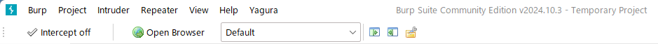
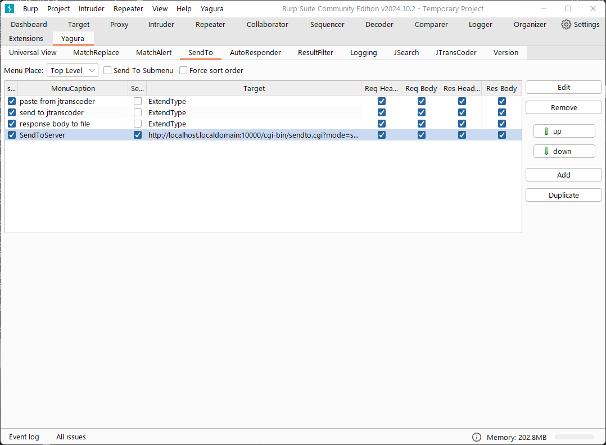
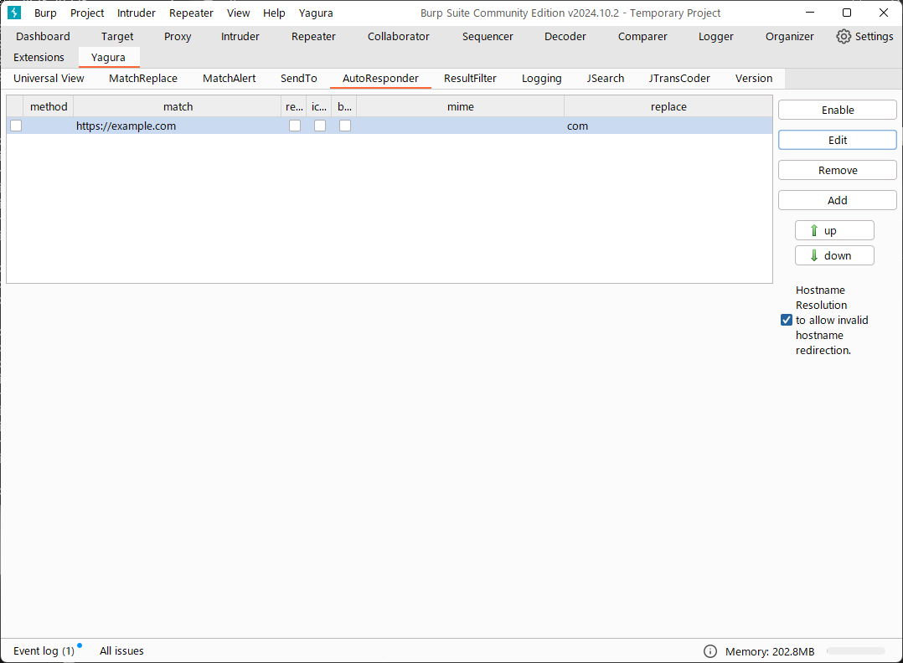
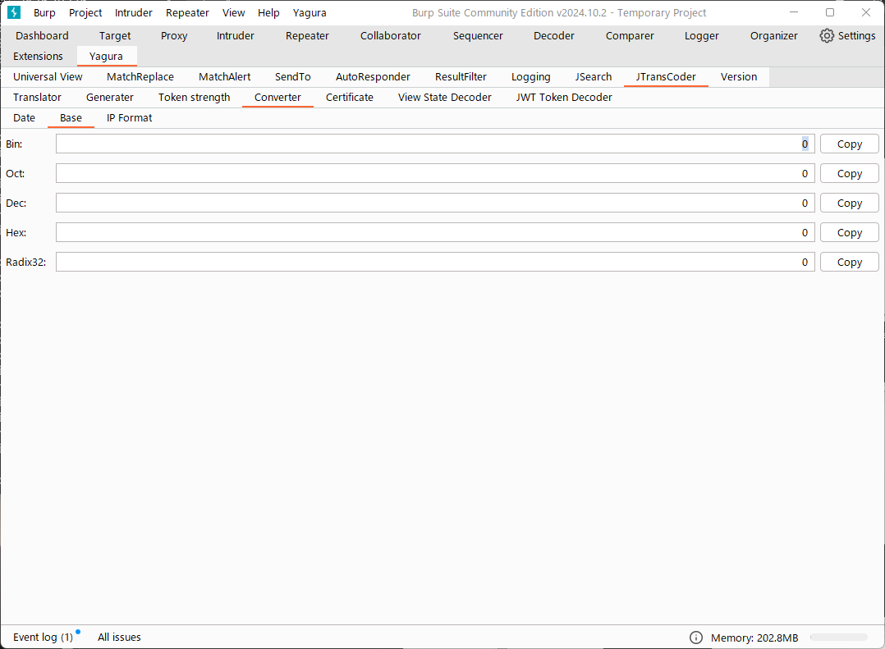
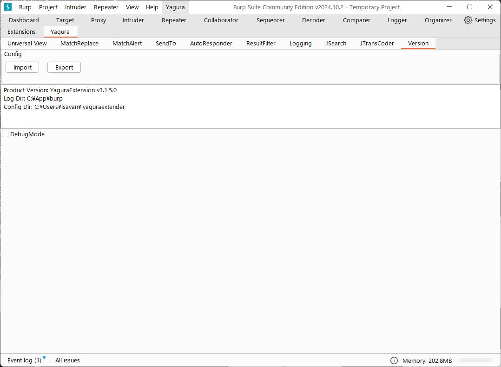

= YaguraExtension Help
:toc2:
:toclevels: 3
:figure-caption: figure
:table-caption: table
:numbered:

Language/xref:help-ja.adoc[日本語]

== Start up 
After pressing the "Add" button from the "Extensions" tab of Burp suite, add YaguraExtension.jar.
Checking "Loaded" will load the extension, and a "Yagura" tab will be added to the tab of the Burp sute body.
Various settings can be done from here.

image:images/Extender_Yagura.png[Extension]

== Yagura Menu

Various Yagura Encode/Decode conversion functions can be called in Intercepter and Repeter.

=== Yagura Charsets

You can select a default character set to be used in the various conversion functions.
You can Encode/Decode with the specified character set.
 
   ISO-8859-1/UTF-8/US-ASCII/... ::
     Specify the character code.
     Selectable character codes can be specified in [CJK View].

   Use Burp Charsets::
      Use Burp'sCharset setting.
      However, if "recognize_automatically" is selected, the charset may not match the charset interpreted by Burp.

=== Yagura Encode Type

   Uppder Case/Lowler Case::
     For case-insensitive conversions, specifies the case of the converted text.

   All/Alphanum/Burp Like/Light/Standard::
     Specify the encoding type to be converted.

=== Encoder

Encode the selected string in the character code selected in "Yagura Charsets".
The following conversions are supported
  
  * URL
  * Unicode(URL)
  * Unicode(JSON)
  * Base64
  * Base64URLSafe
  * Html
  * JSON with Meta
  
=== Decoder

Decode the selected string in the character code selected in "Yagura Charsets".
The following conversions are supported

  * URL
  * Unicode(URL)
  * Unicode(JSON)
  * Base64
  * Base64URLSafe
  * Html
  * JSON with Meta

=== Converter

Converts the selected string in the character code selected in "Yagura Charsets".
The following conversions are supported

  * Upper Case
  * Lower Case
  * bin2hex
  * hex2bin
  * Full width -> Half width
  * Half width -> Full width

=== Hash

Hash calculation the selected string in the character code selected in "Yagura Charsets".
The following conversions are supported

  * md2
  * md5
  * sha1
  * sha256
  * sha384
  * sha512

=== Result Filter

It is possible to switch Bambda mode queries in Proxy History.
You can create a tab to switch Bambda mode in the Result Filter tab.

=== Extension

Run the selected extension.

  Paste include Target scope (multi-line)::
    Add a multi-line URL set on the clipboard to the Target Scope Include in scope.

  Paste Top URL into include Target scope (multi-line)::
    Add a multi-line Top URL set on the clipboard to the Target Scope Include in scope.

  Paste exclude Target scope (multi-line)::
    Add a multi-line URL set on the clipboard to the Target Scope Exclude in scope.

  Paste SSL pass through (multi-line)::
    Add a multi-line URL set on the clipboard to the SSL pass through.

=== Burp Charsets

Changes the character code in the User settings of Burp.
It is equivalent to switching Charsets in Burp's [User Interface] -> [Inspector and Message Editor].

== Yagura tab

=== Universal View tab

==== CJK View tab

image:images/custom_encoding.png[CJK View tab]

Use this tab to configure CJK (Chinese, Japanese, Korean). 
You can select the most frequently used encoding. The value selected here is the encoding that can be selected on the display screen of JTransCoder or JSON view.

Target::
    A list of all encodings available in Java will be displayed.

Select::
    The selected encoding is listed.

[<], [>] button::
    Move the selected encoding to Target or Select.

[Up], [Down] button::
    Moves the order of the selected encoding.
    The order here is the order displayed in the encoding.

[Reset] button::
    Set the encoding for the selected language to the default.

[clip bord auto decode] check box::
    When checked, the character string copied from the Burp suite to the clipboard is automatically decoded so that it can be pasted to other applications without garbled characters.
    Judgment may fail because the character code is inferred from the byte string in the clipboard. +
    Not supported in current version.

===== CJK Message View

[Cenerate PoC] check box::
    Display the "Cenerate PoC" tab in the message tab.
   
[HTML Comment] check box::
    Display HTML Comment tab in message tab.

[JSON] check box::
    Display the JSON tab in the message tab.

[JSONP] check box::
    Display the JSONP tab in the message tab.

[JWT] check box::
    Display the JWT tab in the message tab.

[ViewState] check box::
    Display the ViewState tab in the message tab.

[Universal Raw] check box::
    Display the Raw tab corresponding to CJK in the message tab.
    Currently read-only.

[Universal Param] check box::
    Display the Param tab corresponding to CJK in the message tab.
    Currently read-only.

[lineWrap]::
    Sets whether text will be wrapped in the view or not. If checked, the text will be wrapped.

[Display max length]::
    Sets the maximum size of the View to be displayed. If the size of the request or response is very large, it may stop responding.

==== Burp View tab

[Burp suite ToolBar] check box::

  Show Burp suite Toolbar

=== MatchReplace tab

image:images/custom_matchreplace.png[MatchReplace tab]

It is an extension of ** Match and Replace ** on the Proxy => Option tab of Burp sute itself. Create and switch between multiple ** Match and Replace **.
You can specify a regular expression forward reference as the replacement string. 
The ** Match and Replace ** of the Burp main unit is a unique implementation. Match and Replace on the main unit is evaluated, and then Match and Replace on the extended side is evaluated.

==== MatchReplace

[Select] button::
    Apply the selected MatchReplace.
    If you select Applied again, it will be canceled.
    
[New] button::
    Create a new MatchReplace.
    An empty MatchReplaceItem dialog appears.

[Edit] button::
    Edit the selected MatchReplace.
    The MatchReplaceItem dialog of the selected content is displayed.

[Remove] button::
    Delete the selected MatchReplace.

[Up], [Down] button: 
    Moves the order of the selected MatchReplace.

==== MatchReplace Dialog
image:images/custom_matchreplace_edit.png[MatchReplaceItem Dialog]

[in-scope only] check box::
    Search only when it matches the conditions of Burp Target Scope.

[burp import match and replace rule] button::
    Imports current Burp match and replace settings. +
    Not supported in current version.

[Edit] button::
    Edit the selected MatchReplace.

[Remove] button::
    Delete the selected MatchReplace.

[Up], [Down] button::
    Moves the order of the selected MatchReplace Item.

[All Clear] button::
    Delete all lists.

[Add] button::
    Add MatchReplace Item.

==== MatchReplace Item Edit dialog
image:images/custom_matchreplace_item.png[MatchReplaceItem Edit dialog]

ProtocolType::

* HTTP
** Substitution in the HTTP protocol.
   
* WebSocket
** Substitution in the WebSocket protocol.
   
Type(Replacement target)::
    Select from request heder, request body, response heder, response body.

Match(Before replacement)::
    character string before replacement to be replaced.

Replace(After replacement)::
    replacement character string to be replaced.
    If request heder or response heder is selected as the replacement target and only the replaced character is entered, a header line will be added.
    You can also specify a capture group such as $1, $2.
    Non-ASCII characters cannot be specified here. If specified, the characters will be converted to?.
    To specify a character other than ASCII characters, use meta characters.

Comment::
    Comments to be replaced

[Regexp] check box::
    When checked, enable regular expressions.

[IgnoreCase] check box::
    When checked, ignore case.

[Metachar] check box::
    Enable metacharacters.
    The following meta characters are available.

[options="header", cols="2,8"]
|=======================
|meta char|conversion character
|\r       |Convert to CR(0x0d)
|\n       |Convert to LF(0x0a)
|\b       |Convert to 0x08
|\f       |Convert to 0x0c
|\t       |Convert to TAB(0x09)
|\v       |Convert to 0x0b
|\xhh     |Hexadecimal notation, specify two hexadecimal characters for hh. Use when you want to convert the byte string as it is.
|\uhhhh   |Specify Unicode code in hexadecimal for hhhh in Unicode notation. Unicode characters are automatically converted to the guessed character code of the guessed response. If there is no corresponding character, it is converted to?.
|=======================

[Add All] button::
    header, and MatchAlert Item, which is only supported for the HTTP protocol.

=== MatchAlert tab

image:images/custom_matchalert.png[MatchAlert tab]

Notifies you when a character that matches the specified string appears in the response. It is assumed that a character string of ErrorCode such as Exception is registered.
There are the following five notification methods, and you can select multiple methods at the same time

. How to notify on the Burp Event log tab

. How to notify by message in task tray +
  Not supported in current version.

. How to change HighlightColor of matched history +
  It is effective when proxy is checked.

. How to change the Notes of the matched history +
  It is effective when proxy is checked.

. Create a Scanner Issue with the matched content and the specified value.

==== MatchAlert

[Enable Alert] check box::
    Enable the MatchAlert function when checking.
[Edit] button::
    Edit the selected MatchAlert Item.

[Remove] button::
    Delete the selected MatchAlert Item.

[Add] button::
    Add a MatchAlert Item.

[Add All] button::
    Add MatchAlert Item, which adds request headers; only the HTTP protocol is supported.

==== MatchAlert Item Edit dialog

image:images/custom_matchalert_item.png[MatchAlertItem Edit dialog]

Type(Search target)::
    Select from request or response

Match(Match string)::
    string you want to match.

Target(Alert target)::
    proxy, repeater, spider, intruder, scanner, sequencer
    The checked target will be the target of MatchAlert.

[Regexp] check box::
    Enable regular expression when checked.

[IgnoreCase] check box::
    When checked, ignore case.

[alert tabs] check box::
    Alerts in the Burp suite will be notified.

[try message] check box::
    The tray message will be the notification destination.
    Not supported in current version.

[Highlight Color] check box::
    If the string matches, the HighlightColor of the corresponding Burp History will be the specified color +
    Valid only when you check the proxy log.

[notes] check box::
    If the string matches, the notes of the history of the corresponding Burp will be the specified content +
    Valid only when you check the proxy log.

[capture group] check box::
    When a string is matched, the string of the matched capture group can be set as a comment 
    By specifying a group reference such as "$1", "$2", etc. in the comment section, the value of the corresponding group becomes the comment.

[scanner issue] check box::
    If the strings match, create an issue for that Scanner.

=== SendTo tab

This is a function using the extended menu of Burp.
You can increase the number of right-click menus displayed from the Burp History, etc., and call up the specified function from the menu. The content sent is the content of the selected History request and response.

==== SendTo

[menu place] combo box:: 
     Change the display position of SendToMenu.

* Default
** Display SendToMenu in the default position.

* Top Level
** Display at the Top Level of the popup menu.

[Send To Submenu] check box::
    If checked, the Send To Menu will be displayed as a submenu.

[Edit] button::
    Edit the selected SendToItem.
    The Edit dialog of SendToItem of the selected content is displayed.

[Remove] button::
    Delete the selected SendToItem.

[Up], [Down] button::
    Moves the order of the selected SendToItem.
    The order here is the order displayed in the right-click menu.

[Add] button::
    Add SendToItem.
    An empty SendToItem edit dialog appears.

[Duplicate] button::
    Duplicate SendToItem.
    The edit dialog for the selected SendToItem will appear.
    Each item can be modified and added as desired.
 
==== SendToItem Edit dialog

SendTo has a Base tab and an Extend tab. In the Base tab, it is convenient to register a binary editor, file comparison tool, etc. When you call the editor from the right-click, the binary editor is started with the temporarily created file as an argument. In the case of the comparison tool, you can compare by selecting two histories. This was created because Burp's HEX dump and Compare functions are difficult to use.

The Extend tab has useful functions that cannot be supported by the Base tab.

==== Base tab
image:images/custom_sendto_base.png[SendToItem Edit Base Dialog]

Menu Caption::
    Menu name

Target::
    Describe the execution path of any binary editor or file comparison tool.
    If server is checked, write a URL starting with http:// or https:// .

[server] check box::
    Check when sending to the server.
    If server is checked, send multipart data to the URL described in Target.

[reverse order] check box::
    Send in the reverse order of the selected list.

[requset], [response] check box::
    It is sent to the registered Target when requset or response of the request is checked. +
    Request and response can choose to send either header or body.

===== HTTP Connection Configuration Dialog

If checked for sending to server, the HTTP client used to send SendTo can be configured.

image:images/custom_sendto_server_connection.png[Edit SendToItem SendTo Connection Setting Dialog]

This can be set if the server is checked.

* Use Burp Proxy Settings
** Use Burp's HTTP client for sending SendTo.

* Use Custom Proxy Settings
** Use your own HTTP client for sending SendTo.

.Protocol

{nbsp}{nbsp}{nbsp}{nbsp}Specifies the HTTP protocol.

.Timeout

Connection/Read/Write::
    Specifies the number of seconds until timeout.

.Authorization

Authorization Type::
    Specify the authentication method; BASIC and DIGEST are selectable.

User::
    Specify the authentication user name.
  
Password::
    Specify the authentication password.

.Proxy

Protocol::
    Specify the Proxy protocol: HTTP and SOCKS can be selected.

Host::
    Specify the host of the Proxy.

Port::
    Specify the port number of the Proxy.

User::
    Specify the Proxy authenticated user name.
  
Password::
    Specify the Proxy authenticated password.

.Client Certificate
 [use Client Certificate] checkbox:: Enable client certificates.

.Server Certificate
 [ignore Validate Certification] checkbox:: Ignore HTTPS server certificate validation if checked

===== SendTo Parameter  Configuration Dialog

If checked for sending to server, Customize the request parameters used to send SendTo.

image:images/custom_sendto_server_sendtoparameter.png[SendToItem Edit SendTo Connection Setting Dialog]

override SendTo parameter::
 Use Burp HTTP client for sending SendTo.

use request name::
 Send with the contents specified in the reqName parameter.
 
. annotation notes +
 Send comment on the annotation.

. response title tag +
 Send the value of the response title tag.

. all line
 All lines are used as values.

. first line
 First lines are used as values.

. second line
 After Second lines are used as values.

use request notes::
  The content specified in the reqComment parameter is sent.
  The contents that can be sent are the same as for reqName.

use dummy response if response is null::
  Specifies a dummy response if the response is null.
    
===== The format sent to the server when checking the server

It is sent to the server in the form of multipart data. It includes the following

    host ::
        hostname
    port::
        Port name
    protocol::
        protocol name(http or https)
    url::
        url string
    requset::
        requset
    response::
        response
    reqName::
        request name
    reqComment::
        request comment
    comment::
        comment
    highlight::
        Selected Highlight Color
        One of the following values +
        white, red, orange, yellow, green, cyan, blue, pink, magenta, gray +
        white is equivalent to not selected.
    encoding::
        guess encoding

----
Content-Type: multipart/form-data; boundary=---------------------------265001916915724
Content-Length: 988

-----------------------------265001916915724
Content-Disposition: form-data; name="host"

example.jp
-----------------------------265001916915724
Content-Disposition: form-data; name="port"

80
-----------------------------265001916915724
Content-Disposition: form-data; name="protocol"

http
-----------------------------265001916915724
Content-Disposition: form-data; name="url"

http://example.jp/
-----------------------------265001916915724
Content-Disposition: form-data; name="comment"

-----------------------------265001916915724
Content-Disposition: form-data; name="reqName"

-----------------------------265001916915724
Content-Disposition: form-data; name="reqComment"

-----------------------------265001916915724
Content-Disposition: form-data; name="highlight"

red
-----------------------------265001916915724
Content-Disposition: form-data; name="request"; filename="request"
Content-Type: text/plain

request header and body
-----------------------------265001916915724
Content-Disposition: form-data; name="response"; filename="response"
Content-Type: text/plain

Response header and body
-----------------------------265001916915724
Content-Disposition: form-data; name="encoding"

UTF-8
-----------------------------265001916915724--
----

At the moment, there is no (public) web application that can accept this format.
sample/sendto.php contains a sample PHP application that only receives and displays this format. Please refer here if you want to implement.

==== Extend tab
image:images/custom_sendto_extend.png[SendToItem Edit Extend Dialog]

    send to jtranscoder::
        Sends the selected string to the input of JTransCoder.
    request and response to file::
        Save request and response to a file.
    request body to file::
        Save only the body part of the request to a file.
    response body to file::
        Save only the body part of the response to a file.
    paste from jtranscoder::
        Paste the string from Output of JTransCoder.
    paste from clipboard::
        Paste the character string from the clipboard in the specified encoding.
    message info copy::
        Copy the message information to the clipboard.
    add host to include scope::
        Add URL scheme and host to include in scope.
    add host to exclude scope::
        Add URL scheme and host to exclude in scope.
    add exclude scope::
        Add URL to exclude in scope.

=== AutoResponder tab

You can define a fixed response for a request.

[Enable] button::
    Enables AutoResponder when checked.

[Edit button:: Edits the selected AutoResponderItem: 
    Edits the selected AutoResponderItem.
    The edit dialog of the selected AutoResponderItem is show.

[Remove] button::
    Deletes the selected AutoResponderItem.

[Up], [Down] buttons:::
    Move the order of the selected AutoResponderItem.
    The order here is the order in which AutoResponder is applied.

[Add] button::
    Adds an AutoResponderItem.
    The edit dialog for an empty AutoResponderItem is show.

==== AutoResponderItem Edit Dialog

Method::
    Specifies the method to match; if Any is checked, it will match any method.

Match URL::
    Specify the URL to be matched. The specified value will be matched forward.

[Regexp] checkbox::
    When checking, enable regular expressions for URL to be matched.

[IgnoreCase] checkbox::
    Ignore the case of the URL to be matched when checking.

Replace::
    Specify the file to be used as the response.

[Body only] checkbox::
    Specify the file to be used as a response.
    If unchecked, a response header must also be included in the file.

[Conent-Type] checkbox::
    Specify the Conent-Type of the response. This is valid only when [Body only] is checked.

=== ResultFilter tab

Configure the Proxy to switch Bambda mode.

[New] button::
    Adds an ResultFilterItem.
    The edit dialog for an empty ResultFilterItem is show.

[Edit] button::
    Edits the selected ResultFilterItem.
    The edit dialog of the selected ResultFilterItem is show.

[Remove] button::
    Deletes the selected ResultFilterItem.

[Up], [Down] button::
    Move the order of the selected ResultFilterItem.
    The order here is the order in which ResultFilter is applied.

==== ResultFilterItem Edit Dialog

image:images/custom_resultfilter_item.png[ResultFilterItem  Edit Dialog]

[Convert to Bambda] Button::
    Converts the given configuration into a Bambda query.

[Import Bambda] Button::
    Import Burp Bambda configuration.

=== Logging tab

image:images/custom_logging.png[Logging tab]

Automatic log logging function.
This function automatically saves the log without having to select the log every time.

==== Logging

[auto logging] check box::
    If checked, log will be recorded automatically. It is created in the directory specified by LogDir.

Log Dir::
Specify the directory where logs are created.
    A directory in date format (burp_yyyyMMdd) is created.
    If the same date already exists, the directory for that date is used. If the log file name to be output exists, it will be added.

Log size::
    Specify the maximum size of the log file. If the file limit is reached, a log is created with a new name.
    When the log size reaches the upper limit, it is added like .1, .2.
----
proxy-message.log
proxy-message.log.1
proxy-message.log.2
	:
----

If you specify 0, there is no upper limit.

Compress Log::
     Compresses logs.

===== Logging target

[Proxy Log] check box::
     ProxyLog of the value after the change in Match and Replace or Inspecter is recorded.

[Tool Log] check box::
     Log values of various tools are recorded.

[WebSocket Log] check box::
     Websocket logs will be recorded.

[history is included] check box::
     This can be checked only when auto logging is off.
     If checked, all logs currently recorded in History are recorded in a file.

[Exclude Extension] check box::
     Exclude the configured extension from logging.

===== Temporary project

[Temporary project warning when closing  Burp Suite]  check box::
   If you try to close Burp in the Temporary project state, a pop-up warning will be displayed.

[Popup Time] ::
    Specify the time of popup between 1000 ms and 10000 ms. The default is 3000 ms.

=== JSearch tab

image:images/custom_jsearch.png[JSearch tab]

JSearch tab is a function to search characters from the History list of Proxy.

==== JSearch

[Search] button::
    Search by the value entered in the text box from the history list of Proxy.

[Smart Match] check box::
    Executes a search that considers multiple escapes such as HTML escape and URL encoding.
    Regular expressions cannot be enabled.

[Regexp] check box::
    Enable regular expression when checked.

[IgnoreCase] check box::
    Ignore case when checked.

[in-scope only] check box::
    Set the search target to a path that matches the scope on the Target tab of Burp.

request::
    Specify the search to requests (Header, Body).

response::
    Specify the search target (header, body)

[notes] check box::
    Include notes in search.

Search Encoding::
    Specify the encoding when searching.

=== JTransCoder tab
Transcoder tab is a function to perform various encoding and decoding.

==== Translator
image:images/custom_jtranscoder.png[Translator tab]

Encode Type::
    Specify the character string to be converted when encoding.

Convert Case::
    Specifies whether the hexadecimal representation of the character when it is encoded is uppercase or lowercase.

NewLineMode::
    Specify the line feed code of the editor.

View::
    Checking lineWrap will wrap the display.

Encodeing::
    Specify the encoding of the character to be converted. The encoding that can be selected in the combo box is the one set in the Encoding tab. +
    Check Raw to encode and decode with ISO-8859_1. +
    If you check Guess, the character code will be automatically determined and encoded and decoded.

[Clear] button::
    Clear the contents of Input and Output.

[Output => Input] button::
    Sends the contents of Output to Input.

[Output Copy] button::
    Sends the contents of Output to the clipboard.

History combo box::
    The conversion history is recorded, and you can get the previous conversion by selecting it.

===== Encode/Decode

[Smart Decode] button::
    Automatically determine the character string format and decode.

[Encode]/[Decode] button::
    Performs encoding and decoding conversion using the selected conversion method.

Performs the checked encoding / decoding.

URL(%hh)::
    Performs URL encoding and decoding.

URL(%uhhhh)::
    Performs URL encoding and decoding in Unicode format.

Base64::
    Encodes and decodes Base64 format.

64 newline::
    Specify this when performing line breaks with 64 characters when encoding in Base64 format.

76 newline::
    Specify this when performing line breaks with 76 characters when encoding in Base64 format.

Padding::
    Specify whether to pad when encoding in Base64 format.

Base64URLSafe::
    Encodes and decodes Base64 URLSafe format.

Base32::
    Encodes and decodes Base32 format.

Base16::
    Encodes and decodes Base16 format.

QuotedPrintable::
    Encodes and decodes QuotedPrintable format.

Punycode::
    Perform Punycode encoding and decoding.

HTML(<,>,",')::
    Encode and decode HTML.
    Encoding is performed only for (<,>,',").

&#d;::
    Encodes and decodes the entity reference format in decimal format.

&#xhh;::
    Encodes and decodes the entity reference format in hexadecimal format.

hh(byte)::
    Encodes and decodes in hexadecimal format in byte code units.

\xhh(unicode)::
    Encodes and decodes in hexadecimal format in unicode code units.

\xhh(byte)::
    Encodes and decodes in hexadecimal format in byte code units.

\ooo::
    Encodes and decodes in octal format.

\uhhhh::
    Encodes and decodes in Unicode format.

$hhhh::
    Encodes and decodes in $ format.

Gzip::
    Gzip compression and decompression.

ZLIB::
    Performs compression and decompression by ZLIB.

ZLIB(with Gzip)::
    Performs compression and decompression by ZLIB(Supports GZIP compatible compression).

UTF-7::
    Encodes and decodes UTF-7.

UTF-8::
    Performs UTF-8 encoding. URL-encodes 2-byte, 3-byte, and 4-byte expressions.

C Lang::
    Performs C-style escaping.

JSON::
    Performs JSON literal escaping.

SQL::
    Performs escape in the SQL language format.

Regex::
    Escapes a regular expression.

Metachar checkbox::
    Enables encoding and decoding of meta characters.
    The following meta characters are available.

[options="header", cols="2,8"]
|=======================
|meta char|conversion character
|\r       |Convert to CR(0x0d)
|\n       |Convert to LF(0x0a)
|\t       |Convert to TAB(0x09)
|=======================

===== Format

Minify::
    Compress XML and JSON.

Beautify::
    Format XML and JSON.

[Smart Format] button::
     Formats a string. Supports XML and JSON formatting.

===== Regex

Smart Math::
   Smart Math generates regular expressions to match various escapes.

with Byte::
   When checked, include regular expressions that take byte matching into Smart Math.

===== Hash/Checksum

The hash value is calculated using the value entered in the text area.

md2::
    Calculate hash with md2

md4::
    Calculate hash with md4

md5::
    Calculate hash with md5

sha1::
    Calculate hash with sha1

sha256::
    Calculate hash with sha256

sha384::
    Calculate hash with sha384

sha512::
    Calculate hash with sha512

sha512/224::
    Calculate hash with sha512/224

sha512/256::
    Calculate hash with sha512/256

sha3-224::
    Calculate hash with sha3-224

sha3-256::
    Calculate hash with sha3-256

sha3-384::
    Calculate hash with sha3-384

sha3-512::
    Calculate hash with sha3-512

SHAKE128::
    Calculate hash with SHAKE128

SHAK256::
    Calculate hash with SHAKE256

SKEIN-256-128::
    Calculate hash with SKEIN-256-128

SKEIN-256-160::
    Calculate hash with SKEIN-256-160

SKEIN-256-224::
    Calculate hash with SKEIN-256-224

SKEIN-256-256::
    Calculate hash with SKEIN-256-256

SKEIN-512-128::
    Calculate hash with  SKEIN-512-128

SKEIN-512-160::
    Calculate hash with SKEIN-512-160

SKEIN-512-224::
    Calculate hash with SKEIN-512-224

SKEIN-512-256::
    Calculate hash with SKEIN-512-256

SKEIN-512-384::
    Calculate hash with SKEIN-512-384

SKEIN-512-512::
    Calculate hash with SKEIN-512-512

SKEIN-1024-384::
    Calculate hash with SKEIN-1024-384

SKEIN-1024-512::
    Calculate hash with SKEIN-1024-512

SKEIN-1024-1024::
    Calculate hash with SKEIN-1024-1024

KECCAK-288::
    Calculate hash with KECCAK-288

KECCAK-384::
    Calculate hash with KECCAK-384

KECCAK-512::
    Calculate hash with KECCAK-512

HARAKA-256::
   Calculate hash with  HARAKA-256

HARAKA-512::
   Calculate hash with HARAKA-512

RIPEMD128::
    Calculate hash with RIPEMD128

RIPEMD160::
    Calculate hash with RIPEMD160

RIPEMD256::
    Calculate hash with RIPEMD256

RIPEMD320::
    Calculate hash with RIPEMD320

GOST2012-256::
    Calculate hash with GOST3411-2012-256

GOST2012-512::
    Calculate hash with GOST3411-2012-512

DSTU7564-256::
    Calculate hash with DSTU7564-256

DSTU7564-384::
    Calculate hash with DSTU7564-384

DSTU7564-512::
    Calculate hash with DSTU7564-512

BLAKE2B-160::
    Calculate hash with BLAKE2B-160

BLAKE2B-256::
    Calculate hash with BLAKE2B-256

BLAKE2B-384::
    Calculate hash with BLAKE2B-384

BLAKE2B-512::
    Calculate hash with BLAKE2B-512

BLAKE2S-128::
    Calculate hash with BLAKE2S-128

BLAKE2S-160::
    Calculate hash with BLAKE2S-160

BLAKE2S-224::
    Calculate hash with BLAKE2S-224

BLAKE2S-256::
    Calculate hash with BLAKE2S-256

BLAKE3-256::
    Calculate hash with BLAKE3-256

Tiger::
    Calculate hash with Tiger

PARALLEL128-256::
   Calculate hash with PARALLELHASH128-256

PARALLEL256-512::
   Calculate hash with PARALLELHASH256-512

TUPLE128-256::
   Calculate hash with TUPLEHASH128-256

TUPLE256-512::
   Calculate hash with TUPLEHASH256-512

GOST3411::
    Calculate hash with GOST3411

WHIRLPOOL::
    Calculate hash with WHIRLPOOL

SM3::
   Calculate hash with SM3

CRC32::
    Calculate checksum by crc32

CRC32C::
    Calculate checksum by crc32c

Adler-32::
    Calculate checksum by Adler-32

MurmurHash2/32::
    Calculate checksum by MurmurHash2 32bit

MurmurHash2/64::
    Calculate checksum by MurmurHash2 64bit

==== Generater tab

The Generater has a sequence tab and a random tab.

.sequence tab

The sequence tab is a simple function for generating a continuous character list.

.sequence-Numbers tab

image:images/custom_gene_seq.png[Generater tab]

Generate format string input ::
    format string in C language printf format.
    A format string can specify only one numeric format.

start::
    start number for the list.

end::
    end number of the list. Generates up to the ending number.

step::
    number of increments from start to end.

.sequence-Date tab

image:images/custom_gene_date.png[Generater tab]

Generate format string input ::
    format string in the DateTimeFormatter format of the Java language.

start::
    start date of the list.

end::
    end date of the list. Generated until the end date.

step::
    number of increments of the date from start to end.

[generate] button::
    Generates a list with the specified information.

[List Copy] button::
    Output the generated list to the clipboard.

[Save to file] button::
    Output the generated list to a file.

.random tab

The andom tab is a simple function for generating a random character list.

image:images/custom_gene_random.png[random tab]

Character::
    Character specifies the type of character to be generated.

Character length::
    Specify the length of the number of characters to be generated.

generator count::
    number to generate.

[generate] button::
    Generates a list with the specified information.

[List Copy] button::
    Output the generated list to the clipboard.

[Save to file] button::
    Output the generated list to a file.

==== Converter tab

The Base tab is a simple function for converting radixes.

.Base tab

Bin::
    input the binary number.

Oct::
    input the octal number.

Dec::
    input the decimal number.

Hex::
    input the hexadecimal number.

Radix32 ::
    input the 32-base number.

.Date tab

image:images/custom_converter_date.png[Date tab]

ZoneDate::
    input the date.

Date(Default ZoneId)::
    Displays the date entered converted with the default zone ID.

Unixtime::
    input the unixtime.

Java serial::
    Input the time expressed in Java milliseconds.

Excel serial::
    Input the time represented by the serial value of Excel

.IP Format Tab

Converts an IP address to each format.

Dotted Decimal IP ::
    Enter the IPv4 address to be converted from.

    Example: 192.168.2.1

Dotted Decimal B IP ::
    Convert to an decimal Class B IP address separated by a "."

    Example:192.168.258

Dotted Decimal A IP ::
    Convert to an decimal Class A IP address separated by a "."

    Example:192.11010306

Ineger IP ::
    Converts to a decimal IP address.

    Example: 3221225985

Dotted Octal C IP ::
    Convert to an octal Class C IP address separated by a "."

    Example: 0300.0000.0002.0001

Dotted Octal C IP ::
    Convert to an octal Class B IP address separated by a "."

    Example:0300.0250.0402

Dotted Octal C IP ::
    Convert to an octal Class A IP address separated by a "."

    Example:0300.052000402

Octal IP ::
    Converts to an octal IP address.

    Example: 030000001001

Dotted Hex C IP ::
    Converts to a hexadecimal Class C IP address separated by a "."

    Example: 0xc0.0x00.0x02.0x01

Dotted Hex B IP ::
    Converts to a hexadecimal Class B IP address separated by a "."

    Example:0xc0.0xa8.0x0102

Dotted Hex A IP ::
    Converts to a hexadecimal Class A IP address separated by a "."

    Example:0xc0.0xa8.0x0102

Hex IP ::
    Converts to a hexadecimal IP address.

    Example: 0xc0000201

IPv4 Mapped IPv6 ::
    Convert to IPv4 Mapped IPv6.

    Example: [::ffff:192.168.1.2]

IPv4 to Unicode ::
    Convert to Unicode notation address.

    Example: ①⑨②。①⑥⑧。①。②

==== Certificate tab

Performs various conversions and exports of certificates.

image:images/custom_certificate.png[Certificate tab]

[JKS] [PKCS12] button::
    Choose the type of certificate.

[Import] button::
    Import the certificate.

[Certificate and Private key in PEM format] button::
    Export in PEM format, including private and public keys.

[Certificate in PEM format] button::
    Export in PEM format, including public keys.

[Certificate in DER format] button::
    Export in DER format, including public keys.

[Certificate in DER format] button::
    Export in DER format including the private key.

[Provide certificate on the server] checkbox::
    Starts a server to import certificates on the specified port.
  
[Export] button::
    Export certificates.

==== View State Decoder tab

[ViewState] text area::
  Input the ViewState to decode.

[expand] button::
    Expand the selected tree.

[collapse] button::
    Collapse the selected tree.

[Decode] button::
    Decode ViewState.

[Clear] button::
    Clear ViewState.

==== JWT token Decoder tab

image:images/custom_jtranscoder_JWT_decoder.png[JWT token Decoder tab]

[JWT] text area::
  Input the JWT to decode.

[Header] text area::
  Decode and display the JWT Header.

[Payload] text area::
  Decode and display the JWT Payload.

[Signature] text area::
  Decode and display the JWT Signature.

=== Generate CSRF PoC

This function is mainly for creating PoC for CSRF (Cross Site Request Forgery).

At places where requests can be confirmed, such as the History tab of the Proxy,
Displayed when the selected request is a POST request.

image:images/custom_CSRF_PoC.png[YaguraExtender CSRF-PoC]

[Generate] button::
    Generate PoC according to the set conditions.
    If you change the conditions, you need to generate again by pressing the [Generate] button.
   
[Copy to Clipbord] button::
    Copy the generated PoC to the clipboard. +
    Character codes are ignored.

[Save to file] button::
    Save the generated PoC to a file. +
    It is saved with the specified character code.   
   
[auto submit] check box::
    Generates an automatically submitted PoC.

[Time Delay] check box::
    Generate a PoC to be submitted after a specified time (seconds). +
    Enabled only when [auto submit] is checked.

[https] check box::
    Check if the PoC request needs to be HTTPS.
    The value automatically determined from the selected request will be the default.

[GET] check box::
    Make the PoC request method a GET method.

[multi form] check box::
    Outputs code that is useful for creating a multi-form PoC.

[XHR] check box::
    Create a PoC trap using XHR functions.
   
[with X-Header] check box::
    Set the header starting with "X-" when checking XHR.    

[Legacy FileUpload] check box::
    File upload using textarea. (This is an Internet Explorer-only technique.)

.Content-Type
    auto:: Content-Type is automatically determined.
    urlencode:: Create PoC using text field. +
    multi part:: Make this selection when Content-Type is Multi part. +
    plain:: Select this option if you want to send the contents of Body as is.  +
This option may not work for items that contain binaries. In that case, use the default option.

==== View State tab

image:images/custom_viewstate.png[View State  tab]

[expand] button::
    Expand the selected tree.

[collapse] button::
    Collapse the selected tree.

[Decode] button::
    Decode ViewState.

[Clear] button::
    Clear ViewState.

==== JWT tab

image:images/custom_JWT.png[JWT tab]

[JWT] combo box::
  Select the JWT to decode.

[Header] text area::
  Decode and display the JWT Header.

[Payload] text area::
  Decode and display the JWT Payload.

[Signature] text area::
  Decode and display the JWT Signature.

=== Version
Displays version information.

[Import] button::
    Import settings in JSON format.

[Export] button::
    Export the settings in JSON format.

